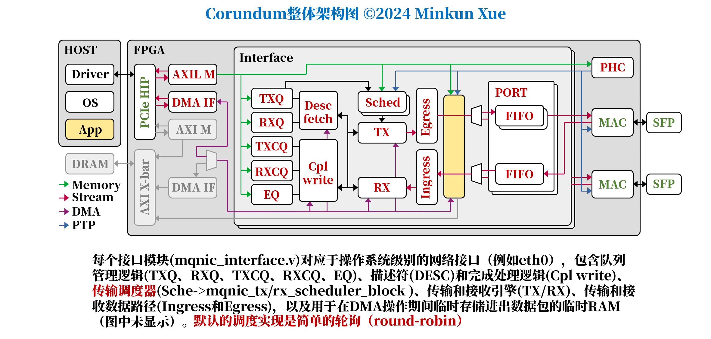
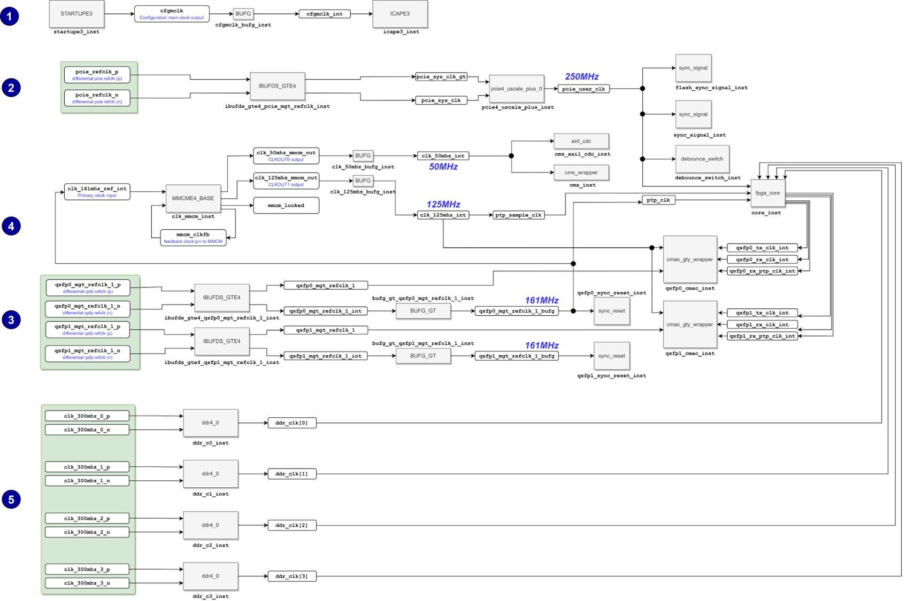

# README:Monkey-X-NIC

这是电子科技大学本科毕设:Monkey-X-NIC（Minkun-Xue-NIC）。对Corundum的调度器进行了改动，实现了SIGCOMM23和SIGCOMM24的可编程调度器设计BMW-Tree和vPIFO。这两项工作是发表于SIGCOMM16的可编程调度模型PIFO的拓展。PIFO此前已经受到广泛的关注和研究。本项目基于Corundum开源网卡，实现了首个支持可编程调度的开源网卡。

## 写作前面

如何使本设计生效？

```verilog
#1生成bitstream
cd /path/to/Monkey-X-NIC/fpga/mqnic/Alveo/fpga_100g/fpga_AU200
make 
#2使用Vivado-Hardware-Manager烧录至Xilinx-Alveo-U200
#此处略
#3热重启板卡
cd /path/to/Monkey-X-NIC/scripts/pcie
sudo ./pcie_reset.sh 41:00.0  #重置PCIe插槽
#4装载驱动
sudo rmmod mqnic  #卸载驱动
sudo ./pcie_rescan.sh #扫描PCIe设备
cd /path/to/Monkey-X-NIC/modules/mqnic
sudo insmod mqnic.ko  #重新装载驱动
#5连通性（使用另一个主机ping）
ip a #查看网口名，为enp65s0np0
sudo ip link set dev enp65s0np0 up
sudo ip addr add 172.0.0.2/24 enp65s0np0
sudo ip link set mtu 9000 dev enp65s0np0
ping 10.0.0.2 #能ping通
#6可编程性测试
cd /path/to/Monkey-X-NIC/scripts/
python3 testx
python3 testy
python3 testz
```

## 0.整体框图

整体设计：



时钟树逻辑整理：



## 1.移植准备

梳理数据包流程：

见6-8节

## 2.关键点

1.HOST向NIC发起**控制交互**的方式为MMIO；NIC向HOST发起**控制交互**的方式为触发中断。

2.**只需要关注发送数据过程**，接收数据过程不涉及调度器。

3.HOST驱动预先构造了两个缓存区，一个for所有描述符队列，另一for所有的skb。

4.描述符和真实的包**都在HOST内存**中，NIC需要发起**两次DMA读**才能获取真实的包：一次for描述符，拿到描述符(存有真包地址及其他信息)后，第二次DMA读到真实包。

5.NIC在发起**两次DMA读操作之前**就决定好了要调度哪个队列。

6.HOST和NIC双方维护发送数据的方式是通过**高度同步的队列生产者指针和消费者指针**。


7.调度器模块能看到的队列信息**只有门铃事件**，**以及调度后的反馈**（成功还是失败，队列是否已经为空）。（即，通知哪个队列有更新），并没有任何优先级信息供给调度器，所以必须增加优先级引脚。

8.**调度器只和TX-QueueManager和TX-Engine进行数据交互**。（还有驱动的高级控制信息去使能某队列是否应该被禁止调度）

9.调度器内部和QueueManger内部通过URAM存储海量队列的控制信息，**读写有延迟**，因此内部通过划分**4级流水线**的方式缓解此问题。

10.**每个门铃事件对应一个包**，在调度器中**只使用了一个doorbell_fifo**，用来**存储所有的门铃事件**。原始状态为per-packet调度。

11.扩展性：每个接口原则上应扩展为可例化多个调度器并发执行调度操作；原则上驱动可以设置为：1 Packet≠1 Doorbell。

12.调度器**尝试在空队列上发送**是一种相对较低成本的场景，而不是假设队列为空，会导致数据包无限期卡住。因此直到反馈信息的到来，它才会将相应队列出队。

13.[linux内核协议栈之网卡发送队列选择_skb set queue mapping-CSDN博客](https://blog.csdn.net/wangquan1992/article/details/128619291)

## 3.TODO List

1.驱动端：在驱动通知NIC有新数据包时，发起MMIO操作通知NIC相应队列的生产者指针更新为指定值的同时，应该做以下修改：

> iowrite给NIC生产者指针信息的同时，应该将此包的**优先级**也传送给NIC。这一方面涉及到如何计算优先级，另一方面涉及到如何发送此优先级。
> 

2.NIC端Queue-Manager：在MMIO事件来临时，做好接收队列更新及其包优先级的准备,并且传递给调度器：

> MMIO事件交由NIC端相应的控制寄存器判断，执行对应的逻辑。这涉及到构造和解析新的控制命令。（为什么不能覆盖原本的旧命令？因为驱动建立存储映射的过程还使用了此旧命令）
> 

3.NIC端Queue-Manager：队列控制表的读写有延迟，整体架构是四级流水线，优先级信息也应该采用流水线方式接收，这涉及以下修改：

> 正确在时序逻辑和组合逻辑中同步和推进queue_priority_next和queue_priority_reg；正确利用其他信号的流水线推进状态，避免产生output的priority和queue_index非同一组的问题。
> 

4.NIC端TX-Scheduler：在Queue_Manager的output到来时，应该正确接收、存储、使用，满足vPIFO的外置需求。

> 这涉及到doorbell事件的reschedule方式，优先级覆盖问题，何种情况doorbell才能入bmw-tree，何种情况应该出bmw-tree，定义好vPIFO的接口。
> 

5.NIC端TX-Scheduler：在处理好外置条件后，定义好接口后。应该做以下工作：

> 需要保证包发送的优先级正确性，以及时序有问题的情况下，应该使得电路在正确的状态，有能力处理BMW-Tree延迟太大。
> 

## 4.更改方案

**1.驱动端：**


对⑥进行更改

```c
void mqnic_tx_write_prod_ptr(struct mqnic_ring *ring,u32 priority)
{
	iowrite32(MQNIC_QUEUE_CMD_SET_PROD_PTR | (ring->prod_ptr & MQNIC_QUEUE_PTR_MASK),
			ring->hw_addr + MQNIC_QUEUE_CTRL_STATUS_REG);
}
改为：
void mqnic_tx_write_prod_ptr(struct mqnic_ring *ring,u32 priority)
{
	iowrite32(**MQNIC_QUEUE_CMD_SET_PRIORITY** | (ring->prod_ptr & MQNIC_QUEUE_PTR_MASK) 
	    | **(priority & MQNIC_QUEUE_PRIORITY_MASK)**,
			ring->hw_addr + MQNIC_QUEUE_CTRL_STATUS_REG);
}
//命令字MQNIC_QUEUE_CMD_SET_PROD_PTR ：0x8080zzzz**改为
//MQNIC_QUEUE_CMD_SET_PRIORITY ：**0xEzzzzzzz
//原本为0x8080zzzz,zzzz为更新后的生产者指针
//现在为0xEzzzzzzz,红色zzz为12位的priority，蓝色zzz为16位的指针。
//why?
//以下原因：必须在此函数中发送命令，这样**只需要发送一次内存屏障**，否则不然。
//其次这种方式能绑定packet和priority的关系。
//命令字段可以修改吗？会不会有问题？
//不会的，我查看了源码，这里还真就没什么特别的要求。
```

这样做绝对是正确的，因为没有引入其他的逻辑结构，最大程度利用了原函数，一定能将priority发给NIC，且NIC一定可以进行区分。

> 为什么改命令字，因为想塞下优先级字段，原命令字占16bit，prod_ptr占16bit；现在为4bit命令字，12bit优先级，16bit的prod_ptr。
> 

**2.NIC端Queue-Manager：**

增加一个case分支如下，引入了**queue_priority_pipeline_reg**，需要正确处理此逻辑：


为什么不覆盖原本的8080zzzz？因为还有不需要传递优先级的过程调用此命令。

**3.NIC端Queue-Manager：**


**4.Queue_Manager的output到达NIC端的scheduler**

原本的架构如下所示：


引入优先级的流程如下：


**梗概：**我做的修改是将queue_ram拓展16bit，用于存放队列的优先级字段。好处在于：不用再自己手动添加复杂的流水线推进（毕竟有近十个事件需要考虑，很容易出错）。

坏处在于有优先级覆盖导致的优先级丢失现象。考虑如下场景：

第n个包到达和第一个包到达的区别在于，有**优先级覆盖的问题，**原因在于queue_ram每个队列的表项只能存储一个优先级。因此新的doorbell的优先级会覆盖掉老的。有优先级丢失现象。**最本质的原因是包并没有和优先级进行强绑定，强绑定会增加很多开销。**

---

我做修改后，调度包进入硬件数据结构只有三种情景：

1.doorbell事件来临，此流还没有在数据结构中。入队。

2.调度器pop出一个流标签，检查active位，如果为1，则表明此流有新的doorbell，resched。重新入队。

3.transmit成功后，tx_engine会返回发送结果（错误，队列为空，发送正确），前两种情况会将对应表项失能，让其无法再重新入队，**直到对应队列有新的doorbell事件。**后一种情况会重新激活该队列，如果此队列未在数据结构中，入队。

---

**总体来说，除了优先级丢失现象，其他的符合vPIFO的外部条件。**

---

**新架构-v2设计**


**5.接口设计**

无论是vPIFO还是BMW-Tree，都应该使用此AXIStream接口：

```verilog

bmw_tree #(
    .DEPTH(2**QUEUE_INDEX_WIDTH),
    .DATA_WIDTH(QUEUE_INDEX_WIDTH),
    .PRIORITY_WIDTH(PRIORITY_WIDTH),
    .KEEP_ENABLE(0),
    .KEEP_WIDTH(1),
    .LAST_ENABLE(0),
    .ID_ENABLE(0),
    .DEST_ENABLE(0),
    .USER_ENABLE(0),
    .FRAME_FIFO(0)
)
u_pifo (
    .clk(clk),
    .rst(rst),

    // AXI input
    .s_axis_tdata(axis_scheduler_pifo_in_queue),
    .s_axis_tpriority(axis_scheduler_pifo_in_priority),
    .s_axis_tkeep(0),
    .s_axis_tvalid(axis_scheduler_pifo_in_valid),
    .s_axis_tready(axis_scheduler_pifo_in_ready),
    .s_axis_tlast(0),
    .s_axis_tid(0),
    .s_axis_tdest(0),
    .s_axis_tuser(0),

    // AXI output
    .m_axis_tdata(axis_scheduler_pifo_out_queue),
    .m_axis_tpriority(axis_scheduler_pifo_out_priority),    //convenient for debugging, and rescheduling.
    .m_axis_tkeep(),
    .m_axis_tvalid(axis_scheduler_pifo_out_valid),
    .m_axis_tready(axis_scheduler_pifo_out_ready),
    .m_axis_tlast(),
    .m_axis_tid(),
    .m_axis_tdest(),
    .m_axis_tuser(),

    // Status
    .status_overflow(),
    .status_bad_frame(),
    .status_good_frame()
);
//如何移植此接口
//正确处理valid和ready逻辑
//此接口为原AXIS-FIFO接口，其实不用也可以，但是为了统一和美观，希望可以改成这种的。
```

## 5.代码实现

见仓库。

## 6. 梳理Corundum整体架构

### 6.1 Corundum与其他开源网卡对比

Corundum，完全开源的100Gbps网卡，主要设计实现了一种可配置的DMA。

**相比于NetFPGA,**NetFPGA更面向交换和分组处理，corundum旨在充当网卡。由于历史原因，NetFPGA网卡参考设计依赖于XDMA和RIFFA作为主机接口，这两种接口都不是为网络应用设计的，因此性能不佳。

**相比于Xilinx的OpenNIC**,OpenNIC 和 Corundum 最大的区别在于 OpenNIC 使用 Xilinx QDMA IP 内核作为主机接口，而 Corundum 使用完全定制的 DMA 子系统。因此，OpenNIC 受益于对 QDMA IP 的现有软件支持，包括 OpenNIC 中的 Linux 网络设备驱动程序和 DPDK PMD。另一方面，Corundum 中的 DMA 子系统更加灵活，支持scatter/gather DMA 以降低 CPU 开销，以及可用于作为用户逻辑的接口，并为所有数据包提供 PTP 时间戳的per-packet metadata。

**Corundum 还支持** TCP/UDP/IP 校验和卸载，以及管理功能，包括通过 PCIe 进行固件更新和与光收发器通信。此外，Corundum 支持各种开箱即用的 FPGA 和 FPGA 板，而 OpenNIC 仅限于 QDMA 支持的设备，不包括各种板的参考设计。OpenNIC 和 Corundum 都可以支持流式数据包处理应用程序，包括在用户逻辑中实现的 P4 程序。市面上已经有了相当一部分智能网卡，包括Tonic、PANIC、NanoPU。Corundum别于所有这些项目，因为它是完全开源的，可以运行在一个标准的主机网络栈，在实际的物理链路。它提供了数千个传输队列和可扩展的传输调度程序，用于流的细粒度控制。这就为开发结合了硬件和软件功能的网络应用程序提供了一个强大而灵活的开源平台。

### 6.2 Corundum整体架构图

**硬件队列状态存储**：Corundum在FPGA块RAM中高效存储硬件队列状态，支持数千个可单独控制的队列。这些队列与接口关联，每个接口可以有多个端口，每个端口都有自己的独立传输调度器。这种设计允许对数据包传输进行极其细粒度的控制。
**调度模块设计**：调度模块设计为可修改或完全换出，以实现不同的传输调度方案，包括实验性调度器。结合PTP（精确时间协议）时间同步（PTP hardware clock），这使得基于时间的调度成为可能，包括高精度TDMA（时分多址）。
**模块化和参数化设计**：Corundum的设计是模块化的，高度参数化。许多配置和结构选项可以在综合时通过Verilog参数设置，包括接口和端口数量、队列数量、内存大小等。这些设计参数在配置寄存器中暴露，驱动程序读取这些寄存器以确定NIC（网络接口卡）配置，使得相同的驱动程序可以支持许多不同的板卡和配置，无需修改。
**高level概述**：Corundum NIC（网络接口卡）的块图展示了NIC的几个层级。顶级模块主要包含support和接口组件，包括PCI Express硬IP核心和以太网接口组件（包括MAC、PHY和相关的串行器），以及一个mqnic_core顶层（wrapper）实例，提供DMA接口。mqnic_core核心模块包含PTP时钟（mqnic_ptp）、APP部分（mqnic_app_block）和一个或多个mqnic_interface模块实例。每个接口模块对应于操作系统级别的网络接口（例如`eth0`），包含队列管理逻辑、描述符（Desc）和完成处理逻辑（Cpl）、传输调度器(Sched)、传输（TX）和接收引擎（RX）、传输和接收数据路径（Ingress和Egress），以及用于在DMA操作期间临时存储进出数据包的临时RAM。队列管理逻辑维护所有NIC队列的状态，包括传输、传输完成、接收、接收完成和事件队列。
**调度器**：对于每个接口，接口模块中的传输调度器（mqnic_tx_scheduler_block）决定哪些队列被指定用于传输。传输调度器生成命令给TX_engine，该引擎协调传输数据路径上的操作。调度模块是一个灵活的功能块，可以修改或替换以支持任意调度，可能是事件驱动的。默认的调度实现是简单的轮询（round-robin）。
**接收方向**：传入的数据包通过一个flow hash module以确定目标接收队列，并为接收引擎生成命令，该引擎协调接收数据路径上的操作。因为同一接口模块中的所有端口共享相同的一组接收队列，不同端口上的传入流合并到同一组队列中。
**APP块**：提供了一个APP块（mqnic_app_block）用于定制，包括数据包处理、路由和网络内计算应用。APP块连接到几个不同的子系统。
**NIC组件的互连**：NIC组件通过几种不同的接口互连，包括AXI lite、AXI stream和**DMA操作的自定义。**

**分段内存接口**（移植时需要研究其接口构造）:AXI lite用于从驱动程序到NIC的控制路径，用于初始化和配置NIC组件以及在传输和接收操作中控制队列指针。AXI stream接口用于在NIC内部传输数据包化数据。分段内存接口用于连接PCIe DMA接口到NIC数据路径以及描述符（Desc）和完成处理逻辑。
**时钟域**：大多数NIC逻辑在PCIe用户时钟域运行，对于所有当前设计变体来说，名义上是250 MHz。而使用异步FIFO与MAC接口，这些MAC在适当的串行器传输和接收时钟域中运行——10G为156.25 MHz，25G为390.625 MHz，100G为322.265625 MHz。

### 6.3 Corundum论坛

Corundum的zulip社区

[](https://corundum.zulipchat.com/)

Corundum的GitHub地址

[https://github.com/corundum/corundum](https://github.com/corundum/corundum)

Corundum的最新branch地址

[https://github.com/alexforencich/corundum](https://github.com/alexforencich/corundum)

Corundum的Wiki Document

[Contents — Corundum documentation](https://docs.corundum.io/en/latest/contents.html)

### 6.4 如何声明版权

以下两者至少取其一，前者是必须的：

1.引用两篇paper之一：

`@inproceedings{forencich2020fccm,
    author = {Alex Forencich and Alex C. Snoeren and George Porter and George Papen},
    title = {Corundum: An Open-Source {100-Gbps} {NIC}},
    booktitle = {28th IEEE International Symposium on Field-Programmable Custom Computing Machines},
    year = {2020},
}

@phdthesis{forencich2020thesis,
    author = {John Alexander Forencich},
    title = {System-Level Considerations for Optical Switching in Data Center Networks},
    school = {UC San Diego},
    year = {2020},
    url = {https://escholarship.org/uc/item/3mc9070t},
}`

2.Github项目link到corundum工程。

## 7. Corundum在transmission过程中包的移动路径

### 7.1 驱动阶段

**1.Linux内核调用**：Linux内核通过`ndo_start_xmit()`调用`mqnic_start_xmit()`函数，传递一个`sk_buff`结构体，表示要发送的数据包。
2.**驱动程序确定队列**：`mqnic_start_xmit()`函数确定数据包的目标发送队列，使用`skb_get_queue_mapping`函数。

> 下文包含了如何根据skb决定发送到哪个queue:[网卡驱动收发包sk_buff相关分析_网卡 skb-CSDN博客](https://blog.csdn.net/weixin_48329334/article/details/140716785)
> 

skb的结构：[blog.csdn.net/YuZhiHui_No1/article/details/38666589](https://blog.csdn.net/YuZhiHui_No1/article/details/38666589)

3.**时间戳标记**：如果需要，`mqnic_start_xmit()`函数会为`sk_buff`打上**时间戳**标记。（PTP）
4.**生成校验和命令**：`mqnic_start_xmit()`函数生成硬件IP校验和命令，并写入描述符。
5.**写入`sk_buff`引用**：`mqnic_map_skb()`函数在`ring->tx_info`中写入`sk_buff`的引用。
6.**生成DMA映射**：`mqnic_map_skb()`函数为`sk_buff`生成DMA映射（使用`skb_frag_dma_map()`或`dma_map_single()`），并构建描述符。
7.**入队数据包**：`mqnic_start_xmit()`函数通过增加生产者指针的本地副本来入队数据包。
8.**更新生产者指针(producer consumer)**：在一批数据包处理结束后，`mqnic_start_xmit()`函数通过MMIO将更新后的生产者指针写入网卡。


### 7.2 queue manager阶段

9.**queue_manager处理**：MMIO写入到达队列管理器（通过PCIe金手指），通过AXI Lite接口。
10.**生成门铃事件**：queue_manager更新生产者指针并生成门铃事件给tx-sched。

### 7.3 **调度器(TX-Sched)阶段**

11.**端口调度器处理门铃事件**：门铃事件到达端口调度器`tx_scheduler_rr`。

12.**标记队列为活跃**：调度器将队列标记为活跃，并在必要时进行调度。

13.**决定发送数据包**：调度器决定发送一个数据包。

14.**生成传输请求**：调度器生成传输请求，通过`m_axis_tx_req_*`接口。

### 7.4 **TX-Engine阶段**

15.**TX_engine接收请求**：发送请求到达TX_engine。
16.**TX_engine请求描述符**：TX_engine发出描述符请求。

### **7.5 Desc_fetch发出出队请求**

17.**desc fetch处理请求**：描述符请求到达`desc_fetch`。

18.**发出出队请求**：desc_fetch向queue_manager发出出队请求。

### **7.6 queue_manager出队阶段**

19.**queue_manager处理出队请求**：queue_manager接收出队请求。

20.**队列非空则开始出队操作**：如果队列不为空，queue_manager开始出队操作。

21.**queue_manager发送响应**：queue_manager发送包含操作状态和DMA地址的响应。

### **7.7 desc_fetch发出DMA读请求**

22.**desc_fetch接收响应**：响应到达desc_fetch。

23.**报告描述符获取状态**：desc_fetch报告描述符获取状态。

24.**发出DMA读请求**：desc_fetch发出DMA读请求。

### **7.8 DMA阶段（跨多模块）**

25.**DMA读接口处理请求**：请求到达DMA读接口`dma_if_pcie_rd`。

26.**发出PCIe读请求**：DMA读接口发出PCIe读请求。

27.**读数据写入DMA RAM**：读回描述符，并写入desc_fetch的本地DMA RAM。

28.**发出状态消息**：DMA读接口发出状态消息。

29.**发出出队确认消息**：desc_fetch发出出队确认消息。

30.**queue_manager提交出队操作**：queue_manager提交出队操作并更新消费者指针（consumer pointer）。

31.**内部DMA模块读描述符**：desc_fetch向其内部DMA模块发出读请求。

32.**描述符通过AXI-Stream传输**：内部DMA模块读取描述符并通过AXI-Stream传输。

33.**描述符到达TX_engine**：描述符到达TX_engine。

34.**存储描述符数据**：TX_engine存储描述符数据。

35.**TX_engine发出DMA读请求**：TX_engine发出DMA读请求。

36.**DMA读接口处理请求**：请求到达DMA读接口。

37.**发出PCIe读请求**：DMA读接口发出PCIe读请求。

38.**读数据写入接口DMA RAM**：读数据以完成数据包的形式返回，并写入接口本地DMA RAM。

39.**发出状态消息**：DMA读接口发出状态消息。

40.**TX_engine发出接口DMA引擎读请求**：TX_engine向接口DMA引擎发出读请求。

41.**TX_engine发出校验和命令**：TX_engine发出传输校验和命令。

42.**接口DMA模块处理数据**：接口DMA模块从接口本地DMA RAM读取数据包数据，并通过AXI-Stream传输。

### **7.9 egress、checksum阶段**

43.**数据包出站处理**：数据包通过`mqnic_egress`进行出站处理。

44.**计算并插入校验和**：tx_checksum模块计算并插入校验和。

### **7.10 APP模块阶段**

45.**数据呈现给APP部分**：数据呈现给`mqnic_app_block`的APP部分。

46.**数据从APP部分返回**：数据从APP部分返回。

47.**数据进入发送FIFO模块**：数据进入每个接口的发送FIFO模块，并被分配到per-port、per-traffic-class的FIFO中。

48.**数据呈现给同步发送APP部分**：数据呈现给`mqnic_app_block`的同步发送APP部分。

49.**数据从同步APP部分返回**：数据从**同步发送APP**部分返回。

50.**数据进入异步FIFO模块**：数据进入每个端口的异步发送FIFO模块，并被转移到MAC TX时钟域。

51.**数据呈现给直接发送APP部分**：数据呈现给`mqnic_app_block`的**直接发送APP**部分。

52.**数据从直接发送APP部分返回**：数据从**直接发送APP**部分返回。

53.**二层出站处理**：`mqnic_l2_egress`进行二层出站处理。

54.**数据通过发送流接口离开**：数据通过发送流接口离开。

55.**数据包被MAC传输并打上时间戳**：数据包被MAC传输并打上时间戳。

56.**时间戳和TX标签通过完成流接口到达**：时间戳和TX标签通过完成流接口到达。

57.**TX-Cpl呈现给直接APP部分**：TX-Cpl呈现给`mqnic_app_block`的直接APP部分。

58.**TX-Cpl从直接APP部分返回**：TX-Cpl从直接APP部分返回。

59.**TX-Cpl进入异步FIFO模块**：TX-Cpl进入每个端口的异步FIFO模块，并被转移到核心时钟域。

60.**TX-Cpl呈现给同步APP部分**：TX-Cpl呈现给`mqnic_app_block`的同步APP部分。

61.**TX-Cpl从同步APP部分返回**：TX-Cpl从同步APP部分返回。

62.**TX-Cpl进入发送FIFO模块**：TX-Cpl进入每个接口的发送FIFO模块，并被放入每个端口的FIFO中，然后聚合成单个流。

63.**TX-Cpl呈现给接口APP部分**：TX-Cpl呈现给`mqnic_app_block`的接口APP部分。

64.**TX-Cpl从接口APP部分返回**：TX-Cpl从接口APP部分返回。

65.**TX-Cpl到达TX_engine**：TX-Cpl到达TX_engine。

66.**TX_engine发出完成写入请求**：TX_engine发出完成写入请求。

### **7.11 完成写入模块（cpl_write阶段）**

67.**完成写入模块写入完成数据**：完成写入模块`cpl_write`将完成数据(描述符)写入其本地DMA RAM。

### **7.12 queue_manager入队请求**

68.**发出入队请求**：cpl_write发出入队请求到TXCQ。

69.**入队请求到达TXCQ**：入队请求到达TXCQ模块。

70.**开始入队操作**：如果队列未满，queue_manager开始入队操作。

71.**发送操作状态和DMA地址响应**：TXCQ发送包含操作状态和DMA地址的响应。

72.**响应到达cpl_write**：响应到达cpl_write。

73.**报告完成写入状态**：cpl_write报告完成写入状态。

74.**发出DMA写请求**：cpl_write发出DMA写请求。

75.**DMA写接口处理请求**：请求到达DMA写接口`dma_if_pcie_wr`。

76.**从cpl_write读取完成数据**：DMA写接口从cpl_write的本地DMA RAM读取完成数据。

77.**发出PCIe写请求**：DMA写接口发出PCIe写请求。

78.**发出状态消息**：DMA写接口发出状态消息。

79.**发出入队确认消息**：cpl_write发出入队确认消息。

80.**TXCQ提交入队操作**：TXCQ提交入队操作并更新生产者指针。

81.**发出事件（if armed）**：TXCQ发出事件。

### **7.13 cpl_write再次发出入队请求**

82.**事件到达cpl_write**：事件到达cpl_write。

83.**将事件数据写入本地DMA RAM**：cpl_write将事件数据写入其本地DMA RAM。

84.**再次发出入队请求**：cpl_write再次发出入队请求到TXCQ。

85.**入队请求到达TXCQ**：入队请求到达TXCQ模块。

87.**开始入队操作**：如果队列未满，queue_manager开始入队操作。

88.**发送操作状态和DMA地址响应**：TXCQ发送包含操作状态和DMA地址的响应。

### **7.14 cpl_write报告完成写入状态，发出DMA写请求**

89.**响应到达cpl_write**：响应到达cpl_write。

90.**报告完成写入状态**：cpl_write报告完成写入状态。

91.**发出DMA写请求**：cpl_write发出DMA写请求。

### 7.15 DMA写请求（跨多模块）

92.**DMA写接口处理请求**：请求到达DMA写接口。

93.**从cpl_write读取事件数据**：DMA写接口从cpl_write的本地DMA RAM读取事件数据。

94.**发出PCIe写请求**：DMA写接口发出PCIe写请求。

95.**发出状态消息**：DMA写接口发出状态消息。

### **7.16 queue manager提交入队op，更新producer pointer**

96.**发出入队确认消息**：cpl_write发出入队确认消息。

97.**TXCQ提交入队操作**：TXCQ提交入队操作并更新生产者指针。

98.**发出中断（if armed）**：TXCQ发出中断。

### **7.17 Linux内核处理**

99.**Linux内核调用中断处理程序**：Linux内核调用`mqnic_irq_handler()`。

100.**中断处理程序调用事件队列处理程序**：`mqnic_irq_handler()`调用事件队列处理程序。

101.**处理事件队列**：`mqnic_process_eq()`处理事件队列，并调用适当的处理程序。

102.**启用NAPI轮询**：`mqnic_tx_irq()`启用NAPI轮询。

103.**rearms事件队列（EQ）**：`mqnic_eq_int()`rearm事件队列。

104.**Linux内核调用NAPI轮询函数**：Linux内核调用`mqnic_poll_tx_cq()`。

105.**处理完成队列**：`mqnic_poll_tx_cq()`调用`mqnic_process_tx_cq()`处理完成队列。

106.**读取完成队列producer pointer**：`mqnic_process_tx_cq()`从网卡读取完成队列producer pointer。

107.**读取完成记录**：`mqnic_process_tx_cq()`读取完成记录。

108.**读取`sk_buff`**： `mqnic_process_tx_cq()`从`ring->tx_info`读取`sk_buff`。

109.**完成发送时间戳操作**：`mqnic_process_tx_cq()`完成发送时间戳操作。

110.**释放TX描述符**：`mqnic_process_tx_cq()`调用`mqnic_free_tx_desc()`释放TX描述符。

111.**取消映射`sk_buff`**：`mqnic_free_tx_desc()`取消映射`sk_buff`。

112.**释放`sk_buff`**：`mqnic_free_tx_desc()`释放`sk_buff`。

113.**出队完成记录**：`mqnic_process_tx_cq()`出队完成记录，通过增加完成队列消费者指针（consumer pointer）。

114.**写入更新的consumer pointer**：`mqnic_process_tx_cq()`通过MMIO写入更新的消费者指针（consumer pointer）。

115.**读取队列consumer pointer**：`mqnic_process_tx_cq()`从网卡读取队列消费者指针（consumer pointer）。

116.**增加环形消费者指针consumer pointer**：`mqnic_process_tx_cq()`增加环形消费者指针（consumer pointer），用于有序释放描述符。

117.**唤醒队列**：`mqnic_process_tx_cq()`如果队列已停止，则唤醒队列。

118.**禁用NAPI轮询**：`mqnic_poll_tx_cq()`在空闲时禁用NAPI轮询。(`napi_complete()`)

119.**rearmedCQ**：`mqnic_poll_tx_cq()`rearms CQ。(`mqnic_arm_cq()`)

## 8. Corundum在receive过程中包的移动路径

### **8.1 初始化（init）**

1. `mqnic_activate_rx_ring()`：激活接收环（ring），调用`mqnic_refill_rx_buffers()`来填充接收缓冲区。
2. `mqnic_refill_rx_buffers()`：为环中的每个空位置调用`mqnic_prepare_rx_desc()`来准备接收描述符（desc）。
3. `mqnic_prepare_rx_desc()`：分配内存页，映射页面，并将DMA指针和长度写入描述符。

### **8.2 三次APP处理**

1. 数据包被MAC层接收并打上时间戳。
2. 数据通过接收流接口进入`mqnic_core`，进行二层入环处理`mqnic_l2_ingress`。
3. 数据被呈现给应用部分`mqnic_app_block`。交互wire为`s_axis_direct_rx`和`m_axis_direct_rx`。
4. 数据进入per-port的rx异步FIFO模块，并被转移到核心时钟域。
5. 数据被呈现给应用部分`mqnic_app_block` 。交互wire为`s_axis_sync_rx`和`m_axis_sync_rx`。
6. 数据进入per-port的异步FIFO模块，并被聚合成单个流。
7. 数据被呈现给应用部分`mqnic_app_block` 。交互wire为`s_axis_if_rx`和`m_axis_if_rx`。

### 8.3 ingress和rx引擎处理

1. 进行入环处理`mqnic_ingress`。
2. 计算数据包流哈希`rx_hash`和数据包有效载荷校验和`rx_checksum`。
3. 生成接收请求给`mqnic_interface_rx`。
4. 接收请求到达接收引擎`rx_engine`。
5. 接收引擎通过`m_axis_rx_desc_*`发出写请求到接口DMA引擎`rx_engine` 。
6. 接口DMA模块`mqnic_interface_rx`将数据包数据从AXI流写入接口本地DMA RAM。通过`rx_axis_*`。
7. 接收引擎`rx_engine`发出描述符请求`m_axis_desc_req_*`。

### 8.4 描述符获取模块

1. 描述符获取模块`desc_fetch`发出出队请求到队列管理器。通过`m_axis_desc_dequeue_req_*`。
2. 队列管理器`queue_manager`处理出队请求并返回操作状态和DMA地址`s_axis_dequeue_resp_*`。
3. 描述符获取模块报告描述符获取状态并通过`m_axis_dma_read_desc_*`发出DMA读请求。
4. DMA读接口发出PCIe读请求`dma_if_pcie_us_rd`并写入desc fetch本地DMA RAM。(通过`s_axis_read_desc_*`)
5. DMA读接口发出状态消息`dma_if_pcie_us_rd m_axis_read_desc_status_*`。
6. 描述符获取模块发出出队提交消息`desc_fetch m_axis_desc_dequeue_commit_*`。
7. 队列管理器提交出队操作并更新消费者指针`queue_manager`。

### **8.5 Linux内核处理**:

1. Linux内核调用中断处理程序`mqnic_irq_handler()`。
2. 处理事件队列并调用适当的处理程序`mqnic_process_eq()`。
3. 启用NAPI轮询`mqnic_rx_irq()`。
4. Linux内核调用`mqnic_poll_rx_cq()`。
5. 处理完成队列`mqnic_process_rx_cq()`。
6. 读取CQ生产者指针，读取完成记录，获取新的`sk_buff`，设置硬件时间戳，取消映射页面，关联页面与`sk_buff`，设置`sk_buff`长度，并将`sk_buff`交给`napi_gro_frags()`。
7. 出队完成记录，更新CQ消费者指针，更新环消费者指针，调用`mqnic_refill_rx_buffers()`。
8. 禁用NAPI轮询`mqnic_poll_rx_cq()`。
9. rearm CQ`mqnic_arm_cq()`。

## 9. 原始corundum各方面性能记录

## 10. 100G-MQNIC移植U200过程记录

参考[Contents — Corundum documentation](https://docs.corundum.io/en/latest/contents.html)第二章Get-Started，但是有很多未完善的部分。

### 本人配置

<aside>
💡

Ubuntu 22.04.05 LTS-Desktop版

内核为Linux 6.5.0-45-generic

Vivado2020.2 HLx

python 3.10

gcc-11

</aside>

Ubuntu 22.04.05 LTS-Desktop版

内核为Linux 6.5.0-45-generic

Vivado2020.2 HLx

python 3.10

gcc-11

### 踩过的坑

**1. 系统方面：**

不能太新，也不能太老。Linux Kernel-6.8在最新branch中也提供了支持，corundum老版本不支持。具体表现为编译驱动会报很多错。

**2.Vivado环境：**

最好使用Vivado2020.2，其他版本见论坛中多少有些错误。

**3.License：**

100G-NIC只需要CMAC-IP的证书，其余版本均不需要任何License。

**4.make工程打开GUI发现许多warning：**

无须更改，原工程禁用了ddr4（DDR4_ENABLE=0），所以会出现ddr4-ip前有红色问号。gty-ip下有多个类似情况，无须修复。

**5.编译器：**

使用gcc-11

**6.仿真环境cocotb搭建：**

corundum的仿真使用的是cocotb，需要python3.10，其余多个版本会出错，相关包依赖安装使用tox.ini中的版本号。

**7.驱动内核签名问题：**

1. 确保安全boot处于disable状态，详见[https://askubuntu.com/questions/773734/how-to-install-module-ko-module-without-kernel-signature-or-kernel-rebuild-in-ub](https://askubuntu.com/questions/773734/how-to-install-module-ko-module-without-kernel-signature-or-kernel-rebuild-in-ub)
2. cd /path/to/corundum/modules/mqnic
3. vi Makefile并且在"KDIR ?= /lib/modules/$(shell uname -r)/build"后添加

```bash
CONFIG_MODULE_SIG=n
```

1. 重新make并且insmod

 之后insmod驱动dmesg仍然会报**无签名**，但是实际上装上去了。

**8.烧录bitstream：**

烧录bitstream有多种方式，最简单也最推荐的方式是使用Vivado GUI的hardware manager。但是此种方式烧录后，**需要注意的是烧录进的是FPGA的易失性存储器，FPGA不可以掉电，否则需要重新烧录。**

**9.如何使设计生效：**

烧录进bitstream后最关键的一步是使得Linux的PCIe重新scan设备。有多种方式：

1. 如果板卡独立供电，则直接硬重启主机即可。
2. 如果板卡由主机供电，且corundum设计固化在非易失性存储器中（由mqnic-fw，或者PCIe金手指烧录），可以直接重启主机。
3. 如果板卡由主机供电，且只是使用Vivado烧录工具经由JTAG烧录，则比较麻烦：

```bash
cd /path/to/corundum/scripts/pcie
sudo ./pcie_reset.sh 41:00.0  #重置PCIe插槽
sudo rmmod mqnic  #卸载驱动
sudo ./pcie_rescan.sh #扫描PCIe设备
cd /path/to/corundum/modules/mqnic
sudo insmod mqnic.ko  #重新装载驱动
```

10.设置ip

```bash
ip a #查看网口名，为enp65s0np0
sudo ip link set dev enp65s0np0 up
sudo ip addr add 172.0.0.2/24 enp65s0np0
sudo ip link set mtu 9000 dev enp65s0np0
ping 10.0.0.2 #能ping通
```
